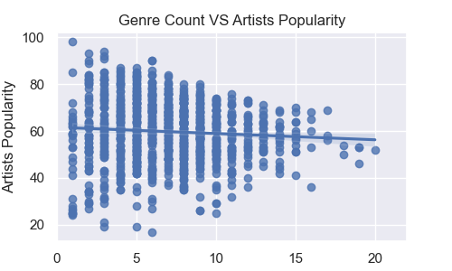
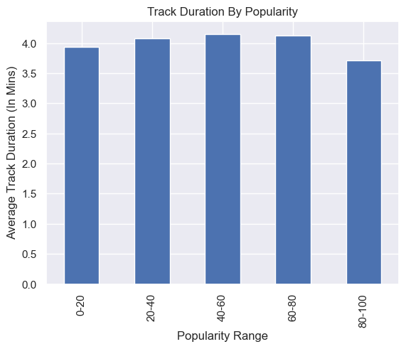
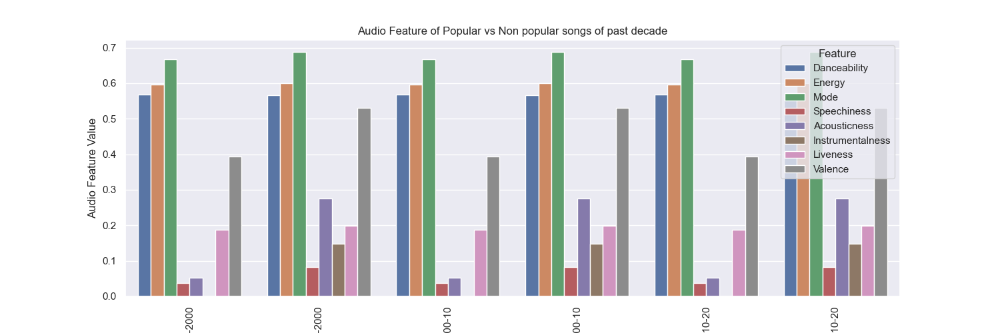

# Spotify Popularity Data-Analysis

##### Music is a word that can have different meanings for every person. Music means artists diversity, happiness, sadness, time to dance, time to get relax, etc. At the end of the story, most of the people love music, and that's the main motivation of this project.

##### The main objective of this analysis was to explore United States Artists Popularity, and for this, the following statements/questions were examined:

##### 1. Genre affect artists popularity?
##### 2. How Audio Features are relating with tracks popularity; and thus, artists popularity?
##### 3. Does Artists' Followers have a strong correlation with artists popularity?
##### 5. How Yearly Releases changes and affect popularity?
##### 6. Does it possible to define Song Trends?

##### The following charts represent a graphical explanation of the previous interrogates:

##### At big scales (several artists, decades, genres) there is not a clear trend between audio features, such as Danceability, Speechines and Artists' Popularity.

##### No relationship between the artist popularity and how many genres each one have. 

##### Tracks with duration shorter than 4 mins were most popular in past decade ( 2010-2020)

##### There is a marked difference in the behaviour of audio features over time

----------------------------------------------------------------------------------------------------------------------------------------------------------------------------------------------------------------------------------------------------------------------------------

### Important Note:

##### To be able to run successfully this notebook, please follow the following instructions:

#### Install spotipy library:

##### 1.  pip install spotipy --upgrade

#### Spotify API application

##### 2. Create an app on https://developers.spotify.com/

#### ID and Secret password

##### 3. Add your new ID and SECRET to your environment:

##### export SPOTIPY_CLIENT_ID=client_id_here
##### export SPOTIPY_CLIENT_SECRET=client_secret_here

#### Jupyter NoteBook

##### 4. Start the Jupyter Notebook

